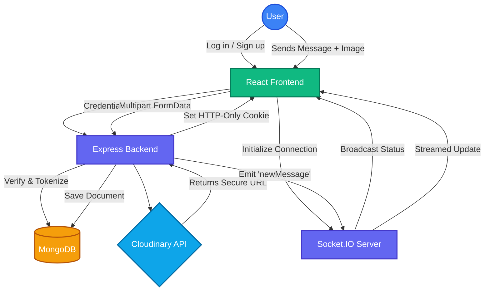

# ChitChat 💬

ChitChat is a full-stack, real-time messaging application. It allows users to connect instantly, exchange text and media, and manage their conversations dynamically. Unlike standard polling-based chats, ChitChat leverages WebSocket connections for instant message delivery, live typing indicators, and real-time message editing/deletion, providing a seamless and interactive user experience.

## ✨ Features

* **Real-Time Communication:** Instant message delivery and online status tracking powered by Socket.io.
* **Rich Media Sharing:** Secure image uploading and rendering via Cloudinary integration.
* **Interactive Chat UX:** Includes real-time typing indicators, emoji picker integration, and smooth auto-scrolling.
* **Message Management:** Edit and delete sent messages with real-time UI updates for all participants.
* **Authentication & Security:** Secure user signup and login using JWT (JSON Web Tokens) in HTTP-only cookies and bcrypt password hashing.
* **Dynamic Theming:** User-toggled Dark/Light mode that persists across sessions.
* **Global Search:** Easily find and connect with other users on the platform.

## 🛠️ Tech Stack

**Client:**
* React + Vite
* Redux Toolkit (State Management)
* Tailwind CSS (Native Dark Mode)
* Socket.io-client & Emoji-picker-react

**Backend:**
* Node.js + Express.js
* MongoDB & Mongoose
* Socket.io (WebSockets)
* JSON Web Tokens (JWT) & Bcryptjs
* Cloudinary & Multer (Image Processing)

## 🏗️ System Architecture & Flow

The following diagram illustrates the data flow and real-time event architecture of the application.



## 📂 Folder Structure

```text
ChitChat/
├── backend/
│   ├── config/             # Database and Cloudinary configuration
│   ├── controllers/        # Route logic (auth, user, messages)
│   ├── middlewares/        # JWT verification (isAuth) and Multer
│   ├── models/             # Mongoose schemas (User, Message, Conversation)
│   ├── public/             # Temporary storage for local file uploads
│   ├── routes/             # Express API routing definitions
│   ├── socket/             # Socket.io connection and event handling
│   ├── .env                # Environment variables (Ignored in git)
│   ├── index.js            # Express server entry point
│   └── package.json
│
└── frontend/
    ├── public/
    ├── src/
    │   ├── assets/         # Static images and icons
    │   ├── components/     # Reusable UI (SideBar, MessageArea, Message Bubbles)
    │   ├── customHooks/    # Data fetching logic (getCurrentUser, etc.)
    │   ├── pages/          # Primary views (Home, Login, SignUp, Profile)
    │   ├── redux/          # Global state slices and store setup
    │   ├── App.jsx         # Main router and Socket initialization
    │   ├── main.jsx        # React root and Context providers
    │   └── index.css       # Tailwind entry point and global styles
    ├── tailwind.config.js
    ├── vite.config.js
    └── package.json
```

## 🚀 Installation and Setup

Follow these steps to run the project locally on your machine.

### Prerequisites
* Node.js (v16 or higher)
* MongoDB (Local instance or MongoDB Atlas cluster)
* Cloudinary Account

### 1. Setup the Backend
Open a terminal in the `backend` directory:
```bash
cd backend
npm install
```

Create a `.env` file in the `backend` directory and add the following variables:
```env
PORT=8000
MONGODB_URL=your_mongodb_connection_string
JWT_SECRET=your_super_secret_jwt_key
CLOUD_NAME=your_cloudinary_cloud_name
API_KEY=your_cloudinary_api_key
API_SECRET=your_cloudinary_api_secret
```

Start the backend server:
```bash
npm run dev
```

### 2. Setup the Frontend
Open a new terminal in the `frontend` directory:
```bash
cd frontend
npm install
```

Start the Vite development server:
```bash
npm run dev
```

## 🌐 API Endpoints

### Authentication Routes (`/api/auth`)
* `POST /signup` - Register a new user
* `POST /login` - Authenticate user and set JWT cookie
* `GET /logout` - Clear JWT cookie

### User Routes (`/api/user`)
* `GET /current` - Get active session user profile
* `GET /others` - Fetch list of all other users
* `GET /search?query=` - Search users by name or username
* `PUT /profile` - Update display name and avatar

### Message Routes (`/api/message`)
* `POST /send/:receiverId` - Send a text or image message
* `GET /get/:receiverId` - Retrieve conversation history
* `PUT /edit/:messageId` - Update text of an existing message
* `DELETE /delete/:messageId` - Remove a message from the database

## 🔮 Future Enhancements
* Implementation of Read Receipts (Seen/Delivered status).
* Group Chat functionality.
* Cursor-based pagination for loading older messages.
* Push notifications for offline users.
* end to end encryption messaging using passkey
* 1:1 video call and group call
